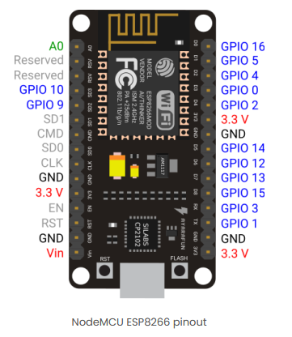
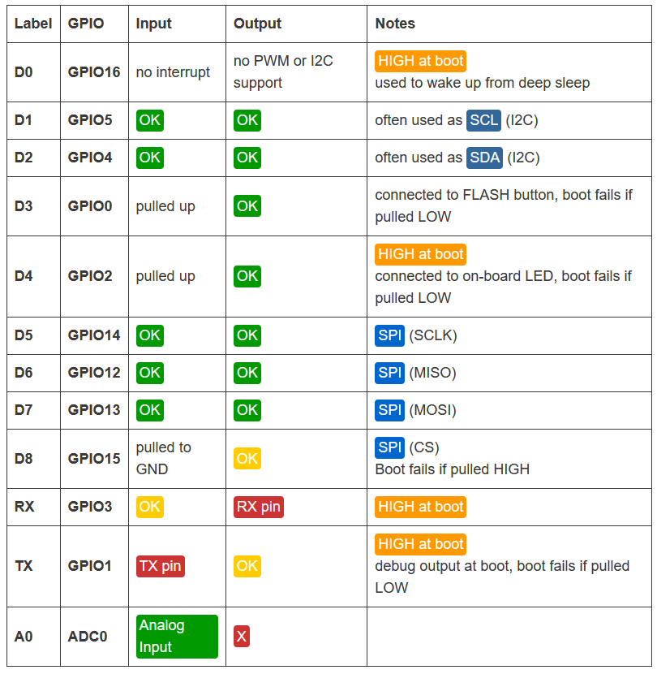

# soft-touch

https://randomnerdtutorials.com/esp8266-pinout-reference-gpios/

avoid using D3 & D8 [(GPIO 0 & 15)](https://stackoverflow.com/questions/41352796/warning-espcomm-sync-failed-error-espcomm-open-failed-error-espcomm-upload-me) else you'll get errors when uploading the sketch

OSC ports:
- receive in Max - 99xx (e.g. sensor 03 will send to 9903)
- send to Arduinos - 88xx
